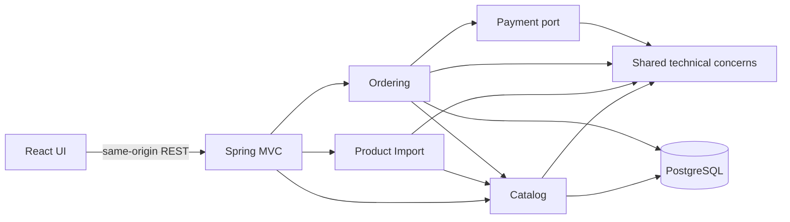

# E-commerce Code Challenge

An enterprise-grade e-commerce application built as a modular monolith. It
delivers product management, product search, validated CSV import, a persistent
shopping cart, and transactional checkout with a fake payment provider.

## Delivered scope

- PostgreSQL local database managed with versioned Flyway migrations.
- Product CRUD, search, pagination, validation, and inventory management.
- Row-level CSV validation with idempotent SKU-based upserts for valid products.
- Transactional purchase flow with deterministic fake payment outcomes.
- React interfaces for product administration, CSV import, catalog search,
  cart review, and checkout.
- Multi-stage, non-root application containers orchestrated with Docker
  Compose behind a single local HTTP entry point.
- Correlated, low-noise business-event logs written to container stdout.
- Unit, module-boundary, persistence integration, API integration, and frontend
  component tests.

## Technology baseline

- Java 21
- Spring Boot 4.1
- Spring Modulith 2.1
- PostgreSQL and Flyway
- Maven Wrapper
- Testcontainers
- React 19, TypeScript, and Vite
- NGINX and Docker Compose

The frontend is a separate React application inside this repository, built with
TypeScript and Vite.

## Quick start

The recommended evaluation path requires only Git and Docker with Docker
Compose v2. Java, Maven, Node.js, and PostgreSQL do not need to be installed on
the host.

```shell
git clone https://github.com/VaGar91/ecommerce.git
cd ecommerce
docker compose up --build --detach --wait
```

The first build needs internet access to download container images and build
dependencies. When the command completes, open `http://localhost:8080`. Verify
the complete stack with:

```shell
docker compose ps
curl --fail http://localhost:8080/healthz
curl --fail http://localhost:8080/api/actuator/health
```

All three services should be healthy. Product administration is available at
`http://localhost:8080/admin/products`, CSV import at
`http://localhost:8080/admin/import`, and the customer catalog at
`http://localhost:8080/catalog`. The administration route names describe their
intended role but are not access-controlled in this challenge; that decision is
documented below.

Stop the application without deleting imported products or orders:

```shell
docker compose down
```

The named PostgreSQL volume preserves data between starts. Running
`docker compose down --volumes` also deletes that database and should only be
used when a clean local catalog is intentionally required. Detailed Docker,
source-development, test, port, and troubleshooting instructions follow below.

## Architecture

The backend is a modular monolith. Spring Modulith treats the direct subpackages
of `com.gila.ecommerce` as application modules:

- `catalog` owns products, inventory, and product search.
- `productimport` parses and coordinates CSV imports through the catalog API.
- `ordering` owns the purchase workflow and order state.
- `payment` defines the payment boundary and its fake implementation.
- `shared` contains technical concerns only, such as error handling and request
  correlation. It must not contain business rules.

A business module exposes its API from its root package. Code below an `internal`
package is private to that module. `shared` is intentionally open because it
contains cross-cutting technical utilities. The allowed compile-time dependencies
are:

- `catalog` → `shared`
- `productimport` → `catalog`, `shared`
- `ordering` → `catalog`, `payment`, `shared`
- `payment` → `shared`
- `shared` → no application module



`ModularArchitectureTest` verifies these rules and rejects cycles or access to
another module's internal implementation.

This architecture was selected because the requested workflows share one
transactional data model and are delivered and reviewed together, while their
business responsibilities still need enforceable ownership. It provides a
single-command deployment today and preserves seams at which search, payments,
or imports could later be extracted if scale or independent ownership justified
the operational cost.

## Development approach

The application was built in independently verifiable vertical slices. The
initial commits established the project, database migrations, and enforceable
module boundaries. Subsequent slices added the catalog, CSV import, ordering,
container packaging, and each frontend workflow. This kept every commit focused
and allowed the domain and API contracts to stabilize before the UI depended on
them.

Business invariants are enforced on the backend even when the frontend performs
the same validation for faster feedback. Prices and stock displayed in the cart
are snapshots for the user experience; checkout reloads and locks the current
database products before charging or changing inventory. Database migrations,
not automatic schema generation, define the production schema.

Tests are placed at the narrowest useful boundary:

- Domain and application unit tests cover catalog rules and CSV parsing.
- Spring Modulith tests enforce module encapsulation and dependency direction.
- Testcontainers integration tests exercise Flyway, PostgreSQL, transactions,
  locking behavior, and HTTP contracts against the real database engine.
- Frontend tests cover routing, forms, search, cart persistence, import reports,
  and successful and failed checkout states.

The final Docker Compose topology is tested as the deployable unit: NGINX serves
the compiled frontend and proxies `/api` to the private Spring Boot service,
which connects to PostgreSQL on the internal Compose network.

## Decisions and alternatives considered

The decisions below are driven by the challenge's evaluation needs: correctness
under concurrent stock changes, transparent data validation, a complete UI, and
reproducible local startup. They are not intended to imply that every production
e-commerce system should use the same topology.

### Java, Spring Boot, and REST

Java 21 was selected for the backend as agreed for the challenge. Spring Boot
provides cohesive support for MVC, validation, persistence, transactions,
health checks, container testing, and production-style configuration without
requiring custom infrastructure code. Resource-oriented JSON endpoints map
directly to product CRUD, search, import, and order workflows, while Spring
`ProblemDetail` gives errors a consistent `application/problem+json` contract.

### Modular monolith instead of microservices

A modular monolith preserves explicit catalog, import, ordering, and payment
boundaries while keeping this challenge a single deployable backend. Spring
Modulith makes those boundaries executable through architecture tests and
private `internal` packages.

Independent microservices were rejected because they would introduce network
contracts, service discovery, distributed tracing, deployment coordination,
and partial-failure handling without improving the requested workflows. A
traditional technical-layer structure was also considered, but grouping all
controllers, services, and repositories together would make ownership and
cross-domain dependencies less visible.

### PostgreSQL instead of an in-memory or document database

PostgreSQL provides the transactions, uniqueness constraints, decimal types,
row locks, and relational order history required by catalog and checkout. Using
the same database through Testcontainers in tests avoids differences between
test and runtime SQL behavior.

H2 would make tests faster to start but can hide PostgreSQL-specific migration,
locking, indexing, and SQL behavior. MongoDB would support flexible product
documents, but the current model benefits more from relational constraints and
transactional stock/order changes. SQLite was not selected because PostgreSQL
better represents the concurrency and schema-management expectations of an
enterprise Java service.

### JPA for persistence and Flyway for schema ownership

Spring Data JPA keeps repository plumbing small while the domain entity owns
catalog invariants and pessimistic row locks protect checkout inventory. Flyway
migrations are the authoritative, reviewable history of tables, constraints,
extensions, and indexes; Hibernate is configured to validate that schema rather
than create or mutate it automatically.

Plain JDBC or jOOQ would provide more explicit SQL and would become attractive
for a query-heavy catalog, but they add mapping and repository code without a
current need. Automatic Hibernate DDL was rejected because it obscures schema
changes and cannot provide controlled production migrations. Database triggers
could enforce stock changes centrally, but keeping the workflow in the catalog
domain makes the rule testable and visible while database constraints still
provide the final integrity boundary.

### React and TypeScript in the same repository

React provides a focused single-page UI for the administration and storefront
workflows, while TypeScript keeps API models and component state explicit. The
frontend lives in the same repository so one commit and one Compose command
describe a compatible full-stack version.

Separate frontend and backend repositories were rejected because coordinated review,
versioning, and local startup would become more complex for this challenge.

### Free-form categories instead of an enum

Categories are validated strings because the supplied data contains an
open-ended set of values. A Java enum would require a deployment for every new
category. A dedicated category aggregate and administration workflow would be
appropriate if categories needed identities, hierarchy, merchandising rules,
or lifecycle management, but those requirements are outside this scope.

### PostgreSQL search instead of a separate search service

Search uses case-insensitive database predicates with pagination. PostgreSQL
trigram GIN indexes support contains queries, and a functional index supports
the exact category filter. This keeps search transactionally consistent with
product changes and avoids another runtime dependency.

Elasticsearch or OpenSearch would become attractive for large catalogs,
language-aware ranking, facets, synonyms, and typo tolerance. For the challenge
dataset, they would add synchronization, eventual consistency, and operational
cost without a demonstrated need. The catalog boundary allows that search
implementation to be replaced later without changing the web contract.

### Valid-row CSV upsert instead of all-or-nothing import or sanitization

The importer validates the complete document, separates accepted rows from
rejected rows, and applies the valid subset in one transaction. Its report makes
the outcome explicit with total, created, updated, and rejected counts plus
field-level errors. Valid rows upsert by normalized SKU, so retrying a corrected
file is safe and refreshes catalog data rather than creating duplicates.

An all-or-nothing import was considered and initially implemented, but one bad
row could prevent a large set of otherwise useful products from loading.
Accepting valid rows gives operators immediate progress while the detailed
report provides the reconciliation contract needed to correct and retry only
the rejected data. Insert-only behavior was rejected because supplier feeds
commonly contain updates.

HTML-like markup is rejected rather than silently sanitized. Sanitization is
rendering-context dependent and could modify a product name or description
without making the change clear to the operator. Rejecting angle-bracket markup
preserves the submitted values for correction, applies consistently to CRUD and
CSV inputs, and is reinforced by a database check constraint. React also escapes
all rendered product text, and persistence remains parameterized.

An asynchronous job would be preferable for very large files, but the explicit
5 MB and 10,000-row limits keep synchronous processing bounded and give the UI
an immediate result.

### Transactional checkout behind a payment boundary

The fake payment provider is an in-process implementation of a small payment
port. Checkout locks requested products in stable identifier order, validates
stock, records immutable line snapshots, and completes within one database
transaction. This makes every fake decline or catalog conflict roll back cleanly.

A real remote payment call must not be treated this way: it would require an
idempotency key, expiring inventory reservation, `PENDING` order state,
asynchronous confirmation or compensation, and an outbox for reliable state
publication. Those mechanisms were deliberately not simulated because the
challenge explicitly removes the external payment provider.

### Browser cart instead of a server-side cart

The cart is stored in React context and local storage so it survives navigation
and refresh without introducing customer identity or sessions. The server does
not trust that state: product IDs and quantities are revalidated during
checkout, and prices come from the locked database rows.

A server-side cart would be the better choice for authenticated customers,
cross-device continuity, promotions, or abandoned-cart processing. Passing the
cart only through page props was rejected because it would couple persistence
and navigation to the route tree.

### One public HTTP entry point

The production frontend container serves static assets and reverse-proxies
`/api` to the backend. This produces same-origin browser requests without a
permissive CORS configuration and keeps the Spring Boot port private to the
Compose network. The frontend and PostgreSQL host bindings are restricted to
loopback for local evaluation.

Publishing the frontend and API independently would be appropriate when they
are deployed and scaled separately, but it would require explicit origin,
TLS, and CORS configuration. Serving the React build from Spring Boot was also
possible, but the NGINX boundary keeps static delivery independent and lets the
backend image contain only the Java runtime and application.

### Authentication deliberately outside the challenge scope

The current application is a local evaluation environment and does not pretend
that hiding a React route provides security. In a production deployment,
catalog reads and category discovery could remain public, while product create,
update, delete, and CSV import operations would require an `ADMIN` role enforced
by Spring Security on the backend. Frontend route guards and hidden navigation
would improve the user experience but would not be the authorization boundary.
Order lookup would also require ownership checks or an administrator role.

A complete identity system was not requested and would introduce user storage,
password recovery or an external identity provider, session lifecycle, CSRF
protection, and authorization tests unrelated to the core challenge. A
hard-coded API key, frontend-only role, or committed administrator password was
rejected because each creates the appearance of security without a credible
security model. If authentication becomes a requirement, the preferred local
architecture is Spring Security with server-side sessions, secure HTTP-only
cookies, CSRF protection, BCrypt password hashes, and backend role checks; a
production deployment would normally delegate identity to an OIDC provider.

### Strategic business logs instead of blanket request logging

Application logs record only meaningful workflow outcomes: product mutations,
CSV import summaries, paid orders, stock conflicts, invalid CSV documents, and
payment declines. Successful outcomes use `INFO`; recoverable business
rejections use `WARN`. Framework and infrastructure failures continue through
Spring Boot's standard error logging. Logs are written to stdout so the same
stream works locally and in containers.

Every backend HTTP response includes `X-Request-ID`. A caller-supplied value is
reused only when it is 1–64 safe ASCII identifier characters; otherwise the
backend generates a UUID. The value is kept in MDC for the duration of the
request and included in application log lines, then removed to prevent
servlet-thread leakage.

Logging every request, search, method entry, or database query was rejected
because it would hide useful events in routine traffic. Request and response
bodies, CSV contents, product text, payment tokens, credentials, and stack
traces for expected validation failures are deliberately excluded. A production
platform could emit the same fields as JSON and ship them to a centralized log
system, but plain key-value console messages are easier to inspect in this local
Docker deliverable and require no collector-specific dependency.

### Local-first verification instead of mandatory hosted CI

The submission's acceptance path is intentionally the same one available to a
reviewer: Docker Compose builds the release artifacts, starts PostgreSQL,
applies migrations, and waits for health checks. Maven and frontend checks are
also runnable locally and integration tests create an isolated PostgreSQL with
Testcontainers.

GitHub Actions or another CI system would be useful as a merge gate and should
run these same checks in a team environment, but it is not a substitute for the
explicit requirement that the application run locally as containers. Hosted CI
and deployment credentials were therefore left out of the challenge deliverable
rather than adding provider-specific configuration that is not required to
evaluate it.

## Example data

The example CSV file supplied with the challenge was downloaded on
**2026-08-19**.

The supplied document is a mixed-quality validation example rather than a clean
seed file. It contains valid quoted and Unicode text alongside malformed prices,
negative stock, missing required values, zero weight, a duplicate SKU, and
HTML- and SQL-like strings. The import completes with a report: valid products
are created or updated, while invalid rows and later duplicate SKU occurrences
are rejected with field-level errors. HTML-like markup is invalid catalog data;
SQL-like text without markup remains inert data because JPA uses parameterized
persistence and React escapes rendered text.

After correcting the rejected rows, the file can be uploaded again. Products
already accepted by the first attempt are updated by normalized SKU, while the
corrected rows are created.

## Running with Docker

Prerequisite: Docker with Docker Compose v2. Run all commands in this section
from the repository root.

Build the application image and start the complete stack:

```shell
docker compose up --build --detach --wait
```

Open the application at `http://localhost:8080`. The frontend health endpoint is
`http://localhost:8080/healthz`, and the proxied backend health endpoint is
`http://localhost:8080/api/actuator/health`. `APP_PORT` changes the application
host port, while `POSTGRES_PORT` changes the PostgreSQL host port. The services
still communicate on their fixed container ports.

For example, on macOS or Linux, use different host ports when either default is
already occupied:

```shell
APP_PORT=18080 POSTGRES_PORT=15433 docker compose up --build --detach --wait
```

The application and health URLs then start with `http://localhost:18080`.

Only the frontend reverse proxy is published as the application entry point.
The Spring Boot service remains private to the Compose network, and the browser
reaches it through same-origin `/api` requests. Both the frontend and PostgreSQL
host ports are bound to `127.0.0.1`, so the local development stack is not
published on external network interfaces.

Inspect service state and logs:

```shell
docker compose ps
docker compose logs frontend
docker compose logs app
```

Follow backend logs, including the business events, with:

```shell
docker compose logs --follow app
```

Representative events are:

- `product_created`, `product_updated`, and `product_deleted`
- `product_import_completed` and `product_import_rejected`
- `order_paid`, `order_stock_rejected`, and `payment_declined`

Event fields contain generated identifiers, row/item counts, stock quantities,
and order totals as applicable. They do not contain request bodies, raw CSV
rows, product descriptions, payment tokens, or credentials.

Stop the stack without deleting PostgreSQL data:

```shell
docker compose down
```

Use `docker compose down --volumes` only when the local database data should
also be deleted.

Both application images are built in two stages. Maven and the JDK remain in the
backend builder stage; its final image contains only the Java 21 runtime, runs
as the unprivileged numeric user `10001`, and defines its own actuator health
check. Node and frontend build dependencies remain in the frontend builder
stage; its final image contains only the compiled static assets and an
unprivileged NGINX reverse proxy. NGINX provides client-side route fallback,
security headers, and the single `/api` gateway to Spring Boot.

### Docker troubleshooting

- If Docker reports that a port is already allocated, override `APP_PORT`,
  `POSTGRES_PORT`, or both as shown above.
- If `--wait` is not recognized, update Docker Compose. As a fallback, run
  `docker compose up --build --detach` and use `docker compose ps` until every
  service reports healthy.
- If a service becomes unhealthy, inspect it with, for example,
  `docker compose logs --tail=200 app`; replace `app` with `frontend` or
  `postgres` for the other services.
- Source changes require another `docker compose up --build --detach --wait` so
  the relevant image is rebuilt. Imported data remains in the named volume.
- If old test data should be discarded, stop the stack and explicitly run
  `docker compose down --volumes`. This is destructive and cannot recover the
  local catalog or orders.

## Running the backend from source

Prerequisites:

- JDK 21
- Docker with Docker Compose v2

Stop the complete Docker stack first if it is running, because its frontend
already owns host port `8080`. Then, from the repository root, start only
PostgreSQL:

```shell
docker compose down
docker compose up -d postgres
```

Start the backend in another terminal:

```shell
./mvnw spring-boot:run
```

The application starts on `http://localhost:8080`. Its health endpoint is
available at `http://localhost:8080/actuator/health`.

The local defaults can be overridden with `DB_URL`, `DB_USERNAME`, and
`DB_PASSWORD`. `POSTGRES_PORT` changes the host port exposed by Compose; when it
is changed, `DB_URL` must point to the same port. The committed credentials are
for local development only. PostgreSQL is exposed on host port `15432` by default
to avoid conflicting with an existing installation on the conventional `5432`
port, and is bound to the loopback interface only.

Stop PostgreSQL without deleting its data:

```shell
docker compose down
```

## Running the frontend from source

Prerequisites:

- Node.js 24.15 or newer
- The backend running on `http://localhost:8080`

From the repository root, install the locked dependencies and start Vite:

```shell
cd frontend
npm ci
npm run dev
```

Open `http://localhost:5173`. Vite proxies `/api` requests to the backend, so
the browser uses a same-origin API path and no development CORS configuration is
required.

## Running tests

Run the complete backend suite from the repository root:

```shell
./mvnw test
```

The integration test suite uses Testcontainers and therefore requires Docker.
It starts an isolated PostgreSQL instance and does not use the Compose database.
The Maven Wrapper downloads its pinned Maven distribution on its first run.

Run linting, all frontend component tests, type checking, and the production
frontend build with:

```shell
cd frontend
npm ci
npm run check
```

## Product API

Product CRUD is available below `/api/products`:

- `POST /api/products` creates a product and returns `201 Created`.
- `GET /api/products/{id}` returns one product.
- `GET /api/products` searches products and returns a page ordered by name and
  SKU.
- `GET /api/products/categories` returns the current distinct categories for
  the catalog and administration filter dropdowns.
- `PUT /api/products/{id}` replaces a product.
- `DELETE /api/products/{id}` deletes a product and returns `204 No Content`.

Create and update requests use this shape:

```json
{
  "name": "Mechanical Keyboard",
  "sku": "KEY-001",
  "description": "Tactile mechanical keyboard",
  "category": "Accessories",
  "price": 49.90,
  "stock": 25,
  "weightKg": 0.850
}
```

SKUs are trimmed, normalized to uppercase, and must be unique. Invalid requests
use `application/problem+json` responses with field-level validation errors.

Product search accepts these optional query parameters:

- `query` performs a case-insensitive contains search across name, SKU,
  description, and category.
- `category` applies a case-insensitive exact category filter.
- `page` selects a zero-based page and defaults to `0`.
- `size` controls the page size, defaults to `20`, and must be between `1` and
  `100`.

## Product CSV import

Upload a CSV as the `file` part of a multipart request:

```shell
curl --fail-with-body \
  --form "file=@products.csv;type=text/csv" \
  http://localhost:8080/api/product-imports
```

The file must be UTF-8, no larger than 5 MB, and contain at most 10,000 product
rows. Its header must contain exactly these columns; their order may vary:

```text
name,sku,description,category,price,stock,weight_kg
```

Completely blank lines are ignored. Every nonblank row is validated before any
database write. Invalid numeric or required values, HTML-like markup, and later
duplicate SKU occurrences reject only their affected rows. The accepted rows
are upserted by normalized SKU in one transaction, making corrected retries
idempotent. A syntactically valid CSV returns `200 OK` with total, created,
updated, rejected, and field-level error details. An invalid document or header
contract returns `400 Bad Request` without changing products.

The supplied example CSV intentionally exercises validation cases, including
nonnumeric prices, negative stock, missing required fields, zero weight,
duplicate SKUs, and HTML-like product names. Its valid rows still load.

## Purchase API

Create and pay for an order with `POST /api/orders`:

```json
{
  "items": [
    {
      "productId": "2e7fbff8-cdf6-4f9f-aee8-997434940848",
      "quantity": 2
    }
  ],
  "paymentToken": "tok_approved"
}
```

The fake payment gateway approves any nonblank token except `tok_declined`,
which deterministically simulates a provider decline. A successful purchase
returns `201 Created` with a `Location` header and an immutable order snapshot.
The order can subsequently be read with `GET /api/orders/{orderId}`.

Checkout locks all requested products in a stable order, validates inventory,
decrements stock, charges the fake provider, and persists the paid order in one
database transaction. A missing product returns `404`, insufficient stock
returns `409`, and a fake payment decline returns `402`; each failure rolls back
all inventory changes. Stock-conflict responses identify the product by name
and SKU and include its product ID, requested quantity, and current availability
as structured fields. Order lines retain product name, SKU, and unit price as
they were at purchase time so later catalog changes do not rewrite order history.

Keeping checkout in one transaction is appropriate for this challenge because
the payment provider is an in-process fake with no independent side effects. A
real remote provider would instead use an idempotency key, an expiring inventory
reservation, and an orchestrated `PENDING` → `PAID`/`FAILED` workflow backed by
an outbox. That avoids holding database locks during network calls and handles
the case where payment succeeds but the local transaction cannot commit.

## Frontend cart state

The storefront keeps the cart in a React context and persists it to browser
local storage so a refresh does not discard an in-progress order. Stored names,
prices, and stock are display snapshots only. Checkout sends product IDs and
quantities to the backend, which reloads the products under database locks and
revalidates current prices and availability. Client state is therefore useful
for the shopping experience but never trusted as a purchase authority.

Server-side carts were considered, but would add customer identity, session
management, and abandoned-cart lifecycle concerns that are outside this
challenge. Passing the cart through page-level props was also rejected because
navigation and persistence would become tightly coupled to the route tree.

## Assumptions and deliberate boundaries

- The application is a local evaluation environment, so it does not implement
  user accounts, authentication, or administrator authorization.
- Product prices use a single implicit currency. Currency conversion, taxes,
  discounts, shipping, and refunds are outside the requested purchase flow.
- Product categories are flat text labels; category hierarchy and management
  are not part of the challenge.
- The fake gateway has no independent side effects and recognizes
  `tok_declined` as its deterministic failure case. No real payment credentials
  are needed or accepted.
- The local cart belongs to one browser profile. The backend remains authoritative
  for product existence, price, and stock at checkout.
- CSV import is synchronous within documented size and row limits. Larger feeds
  would be processed as background jobs with durable progress reporting.
- Committed database credentials are local-only defaults. A real deployment
  would inject secrets, terminate TLS, define backup/restore procedures, and
  restrict administrative endpoints.
- Actuator health endpoints provide container readiness information. Centralized
  log aggregation, metrics, distributed tracing, alerting, and rate limiting
  would be deployment-level additions rather than simulated challenge features.

## Project status

The backend bootstrap, module boundaries, local database infrastructure,
product CRUD and search, row-resilient CSV import, and transactional checkout with a
fake payment provider are complete. The React UI includes product administration,
CSV import, storefront search, a persisted cart, and transactional checkout.
The complete frontend, backend, and PostgreSQL stack is containerized behind a
single local entry point, and strategic workflow logs carry per-request
correlation IDs. All functionality explicitly requested by the challenge is
implemented and can be evaluated with the Docker instructions above. Continuous
integration, browser automation, and production platform integration are
optional extensions, not prerequisites for running the submission locally.
